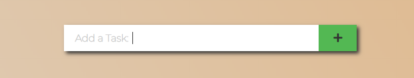

# My Task List

"My Task List" is a web application that helps users stay organized and increase productivity by providing a visual representation of their tasks and progress. Users can add, mark complete, and remove tasks from their list with a simple, easy-to-use interface.

One of the significant benefits of "My Task List" is its ability to save the user's task list in local storage. This feature allows users to return and continue working on their tasks without losing progress. Additionally, the application saves completed tasks, providing users with a sense of accomplishment and motivation as they work towards their goals. Overall, "My Task List" is an effective and efficient solution for anyone looking to manage their tasks effectively and streamline their workflow.

# Features

## Task Input Field

- Provides an input field for adding new tasks: Users can add new tasks to their to-do list by typing them into the input field and clicking the "Add" button. The code checks that the input is not empty before adding the new task to the list.

## Task Section

- Displays tasks in a container with a checkbox and delete button for each item: Tasks are displayed in a container with a white background and a shadow effect. Each task is displayed as a list item with a checkbox on the left and a delete button on the right.

-  Allows users to mark tasks as complete or incomplete with a line-through decoration: When a user checks a task as complete, it is displayed with a line-through decoration. When a user unchecks a completed task, the line-through decoration is removed.

- Allows users to delete tasks with a fade-out animation, which also removes them from local storage: When a user clicks on the delete button, the task is removed from the list and also from local storage. The delete button has an animation that fades out the task before removing it from the list.

