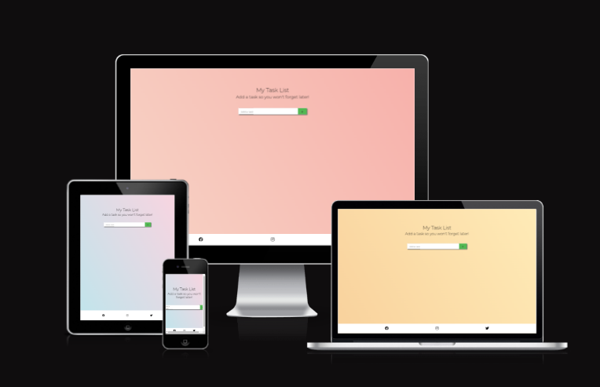
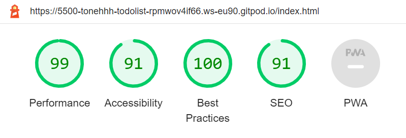

# My Task List

"My Task List" is a web application that helps users stay organized and increase productivity by providing a visual representation of their tasks and progress. Users can add, mark complete, and remove tasks from their list with a simple, easy-to-use interface.

One of the significant benefits of "My Task List" is its ability to save the user's task list in local storage. This feature allows users to return and continue working on their tasks without losing progress. Additionally, the application saves completed tasks, providing users with a sense of accomplishment and motivation as they work towards their goals. Overall, "My Task List" is an effective and efficient solution for anyone looking to manage their tasks effectively and streamline their workflow.

# Features

## Task Input Field

- Provides an input field for adding new tasks: Users can add new tasks to their to-do list by typing them into the input field and clicking the "Add" button. The code checks that the input is not empty before adding the new task to the list.

## Task Section

- Displays tasks in a container with a checkbox and delete button for each item: Tasks are displayed in a container with a white background and a shadow effect. Each task is displayed as a list item with a checkbox on the left and a delete button on the right.

-  Allows users to mark tasks as complete or incomplete with a line-through decoration: When a user checks a task as complete, it is displayed with a line-through decoration. When a user unchecks a completed task, the line-through decoration is removed.

- Allows users to delete tasks with a fade-out animation, which also removes them from local storage: When a user clicks on the delete button, the task is removed from the list and also from local storage. The delete button has an animation that fades out the task before removing it from the list.

## Local Storage

- Another feature is the use of localStorage to ensure that tasks are saved even if the user closes the browser window. This means that users don't have to worry about losing their task list or starting over from scratch every time they close their browser. The use of localStorage is an excellent feature that makes the task list more convenient for users, ensuring that their work is saved and accessible at all times.

## Footer

- Links to social media sites are also provided to users to the appropriate channels for updates and information via Twitter, Facebook and Instagram.

## Random Background Color Generator
- The random color gradient is generated from an array of gradients and applies it as the background of the web page.
- This adds an element of visual appeal to the page and can help to enhance the user experience. 
- The gradient is generated by first defining the gradients as an array of sub-arrays, each containing two color codes that define the start and end colors of the gradient. 
- A random gradient is then selected by generating a random number and using it as an index value to select a gradient from the array.

# Testing
- I've tested the page and everything works fine on different browsers such as Chrome, Brave and Safari.
- I can also confirm the responsiveness looks good on mobile devices, tablets and desktop screens alike.
- All of the content of the web app is clear and readable.

### Bugs
- ##### Solved Bugs
    - When i first deployed my project to GitHub I noticed that my project was broken, none of the CSS was working.
    - I realised I had used an absolute file path was causing the issue like below
- #### Accessibility
    - When I first did the lighthouse test, the web app recieved a low Accessibility score of 70.
    - The primary issue was due to the button and form elements not having appropriate labels, which was a quick fix.
  

#### Validator Testing
- ##### HTML
    - No errors were found when testing through the official W3C validator.
- ##### CSS
    - No errors were found when testing through the official Jigsaw validator.
- #### Javascript
    - No errors were found when testing through JShint.

#### Unfixed Bugs
- No unfixed bugs

## Deployment
- The site was deployed to GitHub pages in the GitHub repository via the Settings Tab
- From the source section drop-down menu then selected the Main Branch
- Once the master main branch was selected, a link to the completed site was provided.
## Acknowledgements

 #### Content
 - The overall project inspiration I got from Youtube videos such as [dcode](https://www.youtube.com/watch?v=cijPd-TXPn4&t=724s) & [Dev A.T Viet Nam](https://www.youtube.com/watch?v=UZ13lvJYPr8&t=20s)

